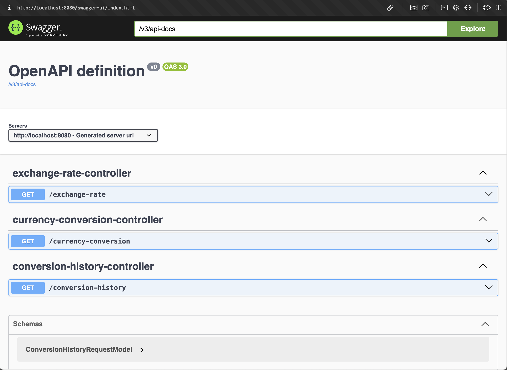

# Foreign Exchange Application
<a name="readme-top"></a>

# Table of contents
1. [Introduction](#introduction)
2. [Which Fine-Tuning Method?](#which-method)
3. [Used Technologies](#technologies)
4. [Getting Started - Running Docker](#docker)

<!-- ABOUT THE PROJECT -->
## Introduction <a name="introduction"></a>
In today's interconnected world, currency exchange is a fundamental service used in various financial applications, enabling businesses and individuals to convert money from one currency to another efficiently. To address this need, we have developed a simple yet robust foreign exchange application. This application provides essential functionality for retrieving current exchange rates, converting currency amounts, and maintaining a history of currency conversions, all while adhering to industry-standard practices and leveraging modern technologies.

The primary goal of this application is to deliver a self-contained, user-friendly solution that requires minimal setup and configuration. Built using Spring Boot, the application ensures a seamless experience for developers and end-users alike. Key features include:

* Exchange Rate Endpoint: Allows users to retrieve the current exchange rate between two specified currencies.

* Currency Conversion Endpoint: Facilitates the conversion of a specified amount from a source currency to a target currency, returning the converted amount along with a unique transaction identifier.

* Conversion History Endpoint: Enables users to query past currency conversions based on transaction identifiers or specific dates, providing a paginated list of results for easy navigation.

* External Exchange Rate Integration: Utilizes a reliable external service provider to fetch up-to-date exchange rates and, optionally, perform currency conversion calculations.

To ensure reliability and robustness, the application incorporates comprehensive error handling, unit testing, and API documentation. Furthermore, it follows REST principles for API design and employs Docker for containerization, ensuring consistency across different environments.

Optional features such as interactive API documentation using tools like Swagger/OpenAPI and caching strategies to enhance performance are also considered. By integrating these advanced features, we aim to provide a high-quality, scalable solution that meets the diverse needs of users in the financial domain.

In summary, this foreign exchange application combines essential currency conversion functionalities with modern development practices, making it a valuable tool for financial transactions in today's globalized economy.

### Project Goal
The primary goal of this project is to develop a simple, self-contained foreign exchange application that provides essential currency conversion services. This application will be built using Spring Boot and will feature a RESTful API design, ensuring ease of use and seamless integration with other systems. The application will leverage an external service provider for fetching current exchange rates, ensuring accuracy and reliability.

### Key Objectives
1. Exchange Rate Retrieval:

* Develop an endpoint that accepts a pair of currency codes and returns the current exchange rate between them.

2. Currency Conversion:

* Create an endpoint that takes an amount, source currency code, and target currency code, and returns the converted amount along with a unique transaction identifier.

3. Conversion History Management:

* Implement an endpoint to retrieve a paginated list of currency conversions filtered by transaction identifier or date.

4. External Service Integration:

* Integrate with a reliable external service provider to fetch up-to-date exchange rates and perform currency conversion calculations when needed.

5. Error Handling:

* Ensure the application handles errors gracefully, providing meaningful error messages and specific error codes to the users.

6. RESTful API Design:

* Follow REST principles to design service endpoints, ensuring scalability and easy maintenance.

7. Code Quality and Structure:

* Implement design patterns to enhance code quality and organize the code to reflect a clear separation of concerns.

8. Unit Testing:

* Include unit tests to validate the reliability and robustness of the application.

9. API Documentation:

* Provide comprehensive documentation for the API, including request and response examples, to facilitate ease of use and integration.

10. Containerization:

* Use Docker to containerize the application, ensuring consistency across different environments.

11. Version Control:

* Maintain the code in a Git repository with a clear history of commits, adhering to best practices for version control.

### Significance
The development of this foreign exchange application is significant for several reasons:

1. User Convenience:

* By providing an easy-to-use API for currency conversion, the application simplifies the process for businesses and individuals who need to handle multiple currencies.

2. Accurate and Reliable Data:

* Integration with external service providers ensures that the application provides accurate and up-to-date exchange rates, which is crucial for financial transactions.

3. Enhanced Performance:

* Implementing caching strategies for exchange rate data can significantly improve the application's performance, making it faster and more efficient.

4. Scalability and Maintenance:

* Following REST principles and implementing design patterns ensures that the application is scalable and easy to maintain, which is essential for long-term use.

5. Consistency Across Environments:

* Containerization with Docker ensures that the application runs consistently across different environments, reducing deployment issues and improving reliability.

6. Comprehensive Documentation:

* Detailed API documentation makes it easier for developers to understand and use the application, facilitating integration with other systems and enhancing overall user experience.

7. Best Practices:

* Adhering to best practices in version control, error handling, and code quality ensures that the application is robust, reliable, and maintainable in the long run.




## Which method? <a name="which-method"></a>
### Prefered Method

### How it works?


<p align="right">(<a href="#readme-top">Back to Top</a>)</p>

## Used Technologies <a name="technologies"></a>
### Spring Boot
Spring Boot is an open-source framework that simplifies the development of stand-alone, production-ready Spring applications. It is part of the larger Spring Framework ecosystem and provides a comprehensive set of features and tools to create and manage Spring applications with minimal configuration and setup.

The benefits of this library are:
* Rapid Development: Reduces the amount of boilerplate code and configuration, enabling developers to focus on writing business logic.

* Microservices Support: Ideal for building microservices architectures due to its embedded server feature and lightweight nature.

* Ease of Use: Simplifies setup and deployment, making it accessible for developers of all skill levels.

* Production-Ready: Includes built-in features for monitoring, health checks, and configuration management.

* Community and Ecosystem: Backed by a large community and an extensive ecosystem of tools and libraries.

### Maven
Maven is a build automation tool primarily used for Java projects. It provides a uniform build system, dependency management, and project management capabilities.

Benefits are:

* Consistency:: Standardizes the project structure and build process, making it easier for developers to understand and manage projects.

* Dependency Management: Handles the complexities of dependency resolution and management, reducing the likelihood of version conflicts.

* Automation: Automates repetitive tasks, improving developer productivity.

### JUnit
JUnit is a widely used testing framework for Java applications. It provides an easy way to write and run repeatable tests, ensuring that code behaves as expected. JUnit promotes the practice of Test-Driven Development (TDD) and helps maintain high code quality through automated testing.

The benefits of using this are:
* Improved Code Quality: Automated testing helps identify and fix bugs early in the development process, leading to higher code quality.

* Regression Testing: The library's straightforward API allows for quick prototyping and experimentation, significantly speeding up the development process.
  Transfer Learning Capabilities: Fine-tune powerful pre-trained models on your specific tasks, leveraging prior knowledge and achieving high performance with less data.

* Documentation: Well-written tests serve as documentation for the code, demonstrating how the code is expected to behave.

* Supports TDD: JUnit promotes Test-Driven Development (TDD), where tests are written before the code, ensuring that the code meets the requirements.

* Integration with Build Tools: JUnit integrates seamlessly with build tools like Maven and Gradle, allowing tests to be run as part of the build process.

### Docker
Docker is an open-source platform that automates the deployment, scaling, and management of applications in lightweight containers. Containers are isolated environments that include everything needed to run an application, including the code, runtime, system tools, libraries, and settings. Docker simplifies the process of developing, shipping, and running applications, ensuring consistency across different environments.

The benefits of using this are:
* Consistency: Docker ensures that applications run the same way in different environments, reducing the "works on my machine" problem.

* Scalability: Docker makes it easy to scale applications horizontally by adding more container instances.

* Isolation: Containers run in isolated environments, which improves security and stability by preventing applications from affecting each other.

* Efficiency: Containers are lightweight and use system resources more efficiently than traditional VMs, leading to faster startup times and lower overhead.

* Portability: Docker containers can run on any system that supports Docker, making it easy to move applications between development, testing, and production environments.

### Swagger/OpenAPI
Swagger and OpenAPI are frameworks for building, documenting, and consuming RESTful web services. Swagger, originally created by SmartBear Software, was later donated to the OpenAPI Initiative, which now maintains the OpenAPI Specification (OAS). The OpenAPI Specification defines a standard, language-agnostic interface to RESTful APIs, allowing both humans and computers to understand the capabilities of a service without accessing the source code.

Benefits of using Swagger/OpenAPI:
* Improved Developer Experience: Comprehensive and interactive API documentation helps developers understand and use APIs effectively, reducing the learning curve and improving productivity.

* Consistency and Standardization: The OpenAPI Specification ensures a consistent approach to API design and documentation, making it easier to integrate and maintain APIs across different teams and organizations.

* Automation: Automated code generation for client libraries, server stubs, and documentation reduces manual effort and ensures consistency between the API implementation and its documentation.

* Testing and Debugging: Interactive tools like Swagger UI allow developers to test and debug APIs directly from the documentation, making it easier to identify and fix issues.

* Interoperability: Standardized API definitions enable better interoperability between different systems and services, facilitating integration and communication.

### In-Memory Database (H2)
H2 is a fast, open-source, lightweight in-memory database written in Java. It is primarily used for development, testing, and prototyping purposes due to its speed and ease of setup. H2 can operate in embedded and server modes, providing flexibility for different use cases. As an in-memory database, it stores data in the system’s memory, leading to extremely fast read and write operations, though it can also persist data to disk if needed.

Benefits of using In-Memory Database (H2):
* Speed: H2’s in-memory mode offers extremely fast read/write operations, which is ideal for testing and development environments.

* Simplicity: H2 is easy to set up and use, requiring minimal configuration, making it a great choice for quick prototyping.

* Versatility: It can run in both embedded and server modes, providing flexibility for different application architectures.

* SQL Compatibility: H2 supports a comprehensive set of SQL features, making it compatible with other databases and ensuring smooth transitions between development and production.

* Integrated Tools: The built-in web console and support for JDBC make it easy to manage and interact with the database.

### Spring Data JPA
Spring Data JPA is a part of the Spring Data project, providing a framework for data access and persistence using Java Persistence API (JPA). It simplifies the implementation of data access layers in Java applications by integrating with JPA and offering a repository abstraction layer. Spring Data JPA enables developers to work with relational databases in a more productive and efficient manner, focusing on the business logic rather than boilerplate data access code.

Benefits of using Spring Data JPA:
* Productivity: Spring Data JPA reduces boilerplate code by automating common data access tasks and providing a powerful repository abstraction.

* Consistency: By using repository interfaces and method names, it ensures consistent data access practices across applications.

* Flexibility: It supports a wide range of query types, including method query derivation, custom JPQL, and native SQL queries.

* Integration: Seamless integration with the Spring ecosystem enhances the development experience and simplifies application configuration and management.

* Maintainability: The abstraction and automatic query generation promote cleaner, more maintainable code by separating data access logic from business logic.

### Redis
Redis (REmote DIctionary Server) is an open-source, in-memory data structure store known for its versatility and performance. It is commonly used as a database, cache, and message broker. Redis supports various data structures, including strings, hashes, lists, sets, sorted sets, bitmaps, hyperloglogs, and geospatial indexes, making it suitable for a wide range of applications.

Benefits of using Redis:
* Performance: Redis’s in-memory nature allows for very low latency and high throughput operations, making it ideal for use cases requiring fast data access.

* Flexibility: Support for various data structures enables Redis to handle a wide range of use cases beyond simple key-value storage.

* Persistence: Options for data persistence ensure that Redis can be used in scenarios where data durability is required, not just as a cache.

* Scalability: Redis supports clustering and replication, allowing it to scale horizontally and provide high availability.

* Simplicity: The Redis API is straightforward, and the server is easy to configure and maintain, which accelerates development and deployment.

* Real-Time Messaging: The pub/sub capabilities of Redis support real-time messaging patterns, making it useful for applications requiring real-time communication.

<p align="right">(<a href="#readme-top">Back to Top</a>)</p>

<!-- GETTING STARTED -->
## Getting Started - Running Docker <a name="docker"></a>
To run the Docker container, use the following commands.

### Update env variables
To change the variables, please run the following command:
  ```sh
  pip install -r requirements.txt
  ```

There are default env variables if you do not want to change env variables.

### Compose
In a terminal, type:
  ```sh
  streamlit run main.py
  ```

### Run
In a terminal, type:
  ```sh
  streamlit run main.py
  ```


<p align="right">(<a href="#readme-top">Back to Top</a>)</p>
